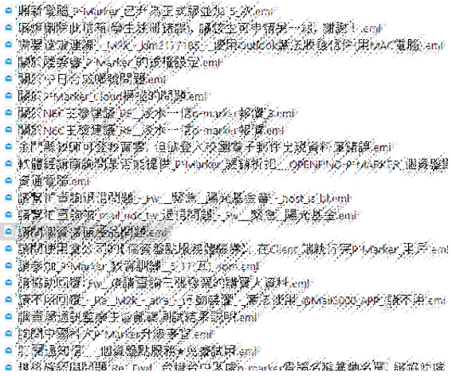
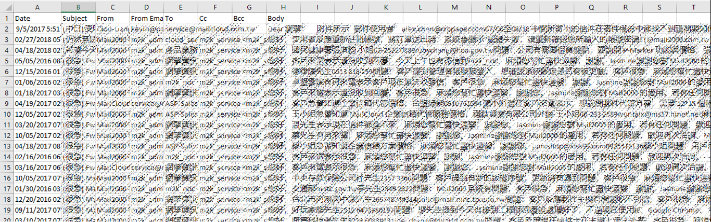
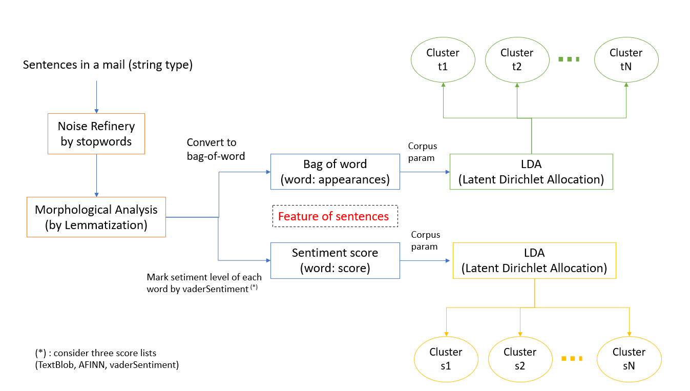
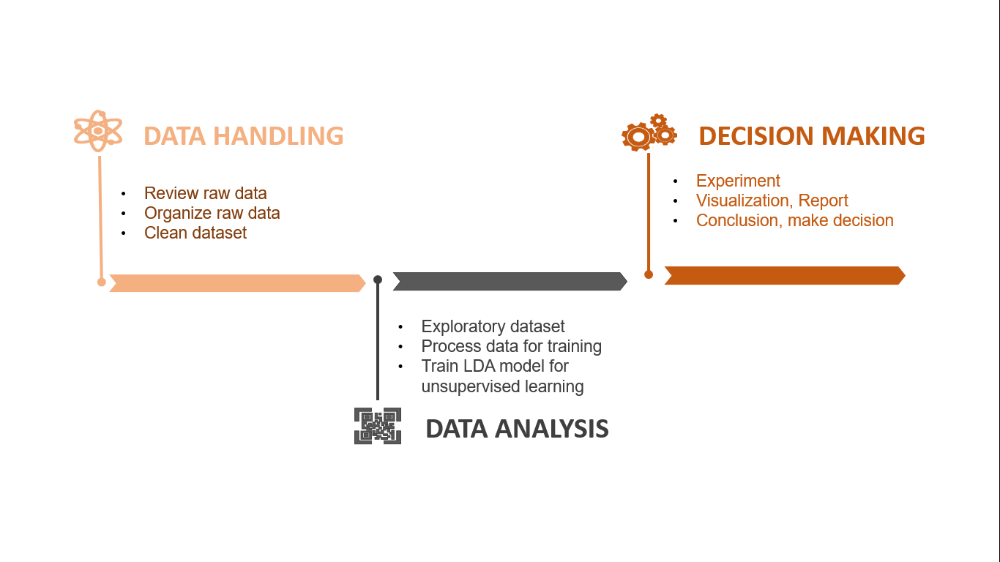

# NTUST_Big-data_Final-project: AI matchmaking - customer questions and preferences

## Introduction

This is repository for final project of Big data analysis course. Topic of final project is [AI matchmaking - customer questions & preferences](materials/第3組_AI_人工智慧_報告_v2_20220512_V2.pdf).
## Dataset Description
1. <strong>Raw dataset:</strong>

  [Raw dataset](dataset/project_textmining_rawdata_20220518) includes 2,526 eml files which imply 2,526 emails sent from customers. Those emails were gathered in the period from 2015 - 2018. The records from various sources such as Mail2000, MailCloud, MailGates, Green Edm.

  <strong>* Overview Dataset</strong>: The raw dataset is described as below image.
  
  

2. <strong>Organized dataset:</strong>

  [Organized dataset](dataset/organized_dataset/) is result of converting raw dataset into compuatable format. In detail, 2,526 emails from raw dataset were allocated in an CSV file. This CSV file consists of 2,526 tuples corresponding to 2,526 emails and 7 attributes (Date, Subject, From, From Email, To, Cc, Bcc, Body) of each email.

  <strong>* Overview Dataset</strong>: The organized dataset is described as below image.
  
  

## Architecture
1. <strong>Problem definition:</strong>
 
  * There are two problems that need to be solved. The first thing, **topic analysis** for classifying topic of email. The second thing, **sentiment analysis** for classifying emotions of customers.  
  * Learning type: The dataset with 2,526 files is a tough challenge for anyone to label each data in this dataset by hand. Moreover, dataset may increase up to hundred thousands in the future since 2,5s26 samples are not enough to build a model with the good performance. Therefore, **unsupervised learning type** is such the best choice for the problem.
2. <strong>Methodology:</strong> 
  
  From organized dataset, we manipulate some pre-processing steps to get sentences which are corresponding to each email. Then, each sentence will be taken to model for classify unsupervisedly. 
  
  
  
## Task division:
  
  * **Vo Van Truc**: Data handling (review data, organise data, clean dataset)
  * **洪郡澤 (Nick)**: Explore dataset, process data for training (topic analysis)
  * **Trinh TT Quynh**: Propose Idea, Train LDA model for training, Experiment
  * **Le Minh Tuong**: Propose Idea, process data for training (sentiment analysis), manage project
  * **Nguyen PT Nguyen**: Decision making (visualization, conclusion, making decision)
  
  

