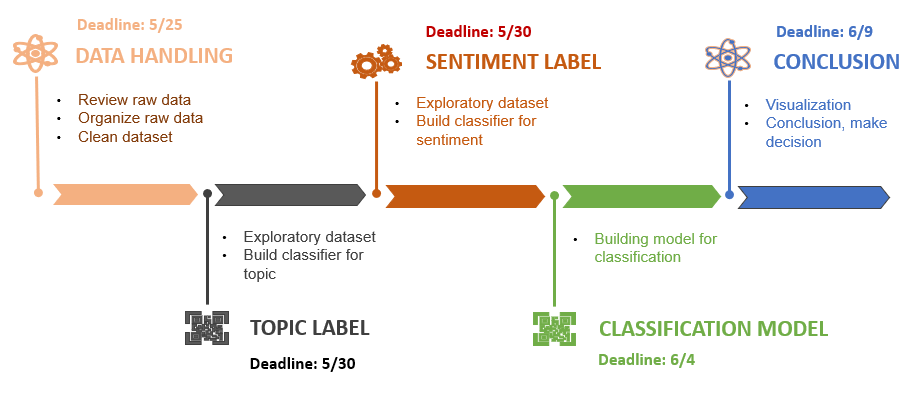

# NTUST_Big-data_Final-project: AI matchmaking - customer questions and preferences

## Introduction

This is repository for final project of Big data analysis course. Topic of final project is [AI matchmaking - customer questions & preferences](materials/第3組_AI_人工智慧_報告_v2_20220512_V2.pdf).
## Dataset Description
1. <strong>Raw dataset:</strong>

  [Raw dataset](dataset/project_textmining_rawdata_20220518) includes 2,526 eml files which imply 2,526 emails sent from customers. Those emails were gathered in the period from 2015 - 2018. The records from various sources such as Mail2000, MailCloud, MailGates, Green Edm.

  <strong>* Overview Dataset</strong>: The raw dataset is described as below image.
  
  

2. <strong>Organized dataset:</strong>

  [Organized dataset](dataset/organized_dataset/) is result of converting raw dataset into compuatable format. In detail, 2,526 emails from raw dataset were allocated in an CSV file. This CSV file consists of 2,526 tuples corresponding to 2,526 emails and 7 attributes (Date, Subject, From, From Email, To, Cc, Bcc, Body) of each email.

  <strong>* Overview Dataset</strong>: The organized dataset is described as below image.
  
  

## Architecture  

I, **Project statement**: find the topics and sentiment from unlabeled emails.  

II, **Project description**: the dataset contains 2,526 Outlook email without label. Therefore, the main process should be contained steps  

1. Data convert and prepocessing  
2. Using topic modeling to find the main topics of the dataset and in each email  
3. Finding the sentiments expressed in the dataset and in each email  
4. (if possible) verify the result of step 2 and 3 and labeling quality to decide futher classification model for new email coming.

III, **Approaches**  

Using unsuperised model (and Semi-superviased if step 4 above is feasible)  
- **Topics** using pretrained Bert Embedding to embedd text and visuliaze embedding to find appropriate cluster number (number of topics) . Output: csv file of emails and their possible topics  
- **Sentiment** ....  tobeupdated

IV, **Evaluation** as no labeled data to compute the accuracy so the human varification is proposed  

2. <strong>Methodology:</strong> 
  
  From organized dataset, we manipulate some pre-processing steps to get sentences which are corresponding to each email. Then, each sentence will be taken to model for classify unsupervisedly. 
  
    
  
  **tobeupdated**
  
## Task division:
  
  * **Vo Van Truc**: Data handling (review data, organise data, clean dataset)
  * **洪郡澤 (Nick)**: Explore dataset, process data for training (topic analysis)
  * **Trinh TT Quynh**: Propose Idea, topic modeling, Experiment
  * **Le Minh Tuong**: Propose Idea, process data for training (sentiment analysis), manage project
  * **Nguyen PT Nguyen**: Decision making (visualization, conclusion, making decision)
  
  

